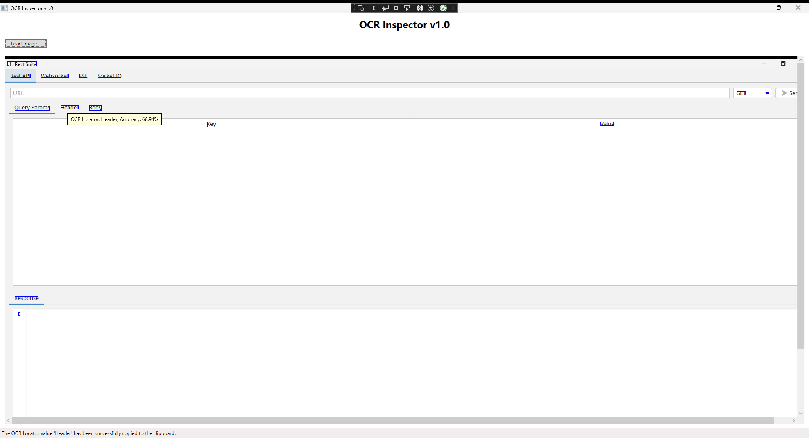

# OCR Inspector v1.0

OCR Inspector is a WPF application that uses Tesseract OCR to process images, recognize text, and display the results with interactive elements. This application allows users to load images, perform OCR, and view the recognized words along with their confidence levels. Users can also copy OCR results to the clipboard directly from the UI.

## Features

- Load and display images in their original size.
- Perform OCR on loaded images using Tesseract OCR.
- Display recognized words with bounding boxes.
- Interactive tooltips for recognized words showing text and accuracy.
- Copy OCR results to the clipboard.

## Screenshots



## Quick Start

### Prerequisites

- .NET Framework 8.0 or later
- Visual Studio 2022 or later
- [Emgu CV](https://www.emgu.com/wiki/index.php/Main_Page)
- [Tesseract OCR](https://github.com/tesseract-ocr/tesseract)

### Installation

If you want to OCR extra languages, download the [Tesseract language data files](https://github.com/tesseract-ocr/tessdata) and place them in a folder named `TrainData` in the root of your project directory or application.

#### From Source

1. **Clone the Repository:**

   ```sh
   git clone https://github.com/g4-api/ocr-inspector.git
   cd ocr-inspector
   ```

2. **Open the Solution:**

   Open `OcrInspector.sln` in Visual Studio.


#### From Releases

1. **Download the Latest Release:**

   Go to the [GitHub Releases](https://github.com/your-username/OcrInspector/releases) page.

2. **Download the ZIP File:**

   Download the ZIP file from the release assets.

3. **Unzip the File:**

   Extract the contents of the downloaded ZIP file.

### Usage

1. **Run the Application:**

   - If you built from source, press `F5` in Visual Studio to build and run the application.
   - If you downloaded the executable, double-click the `OcrInspector.exe` file.

2. **Load an Image:**

   - Click the "Load Image..." button to open a file dialog.
   - Select an image file (`.jpg`, `.jpeg`, `.png`, `.bmp`).

3. **View OCR Results:**

   - The application will display the image with recognized words highlighted.
   - Hover over the highlighted words to see tooltips with OCR details.
   - Right-click on the highlighted words to copy the OCR text to the clipboard.

## License

This project is licensed under the MIT License - see the [LICENSE](LICENSE) file for details.
